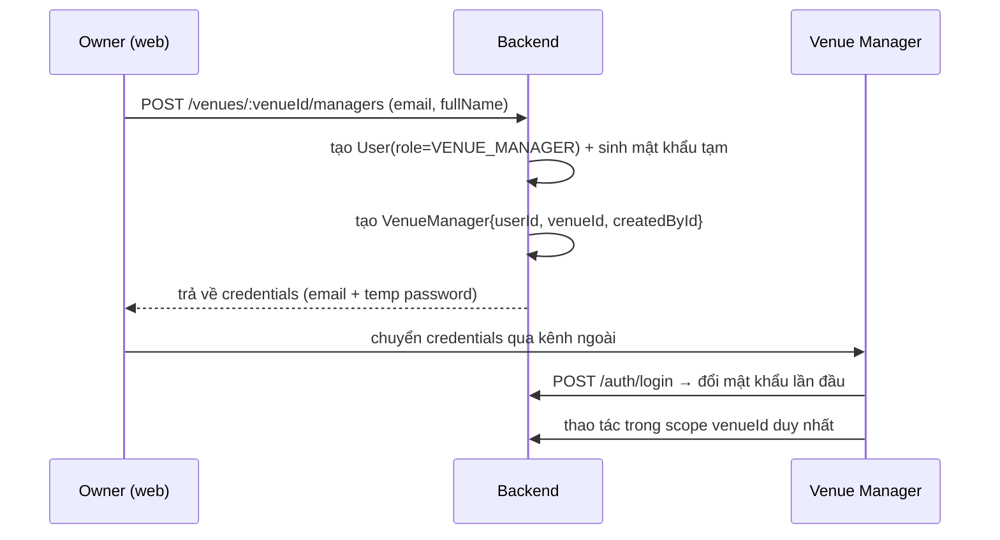
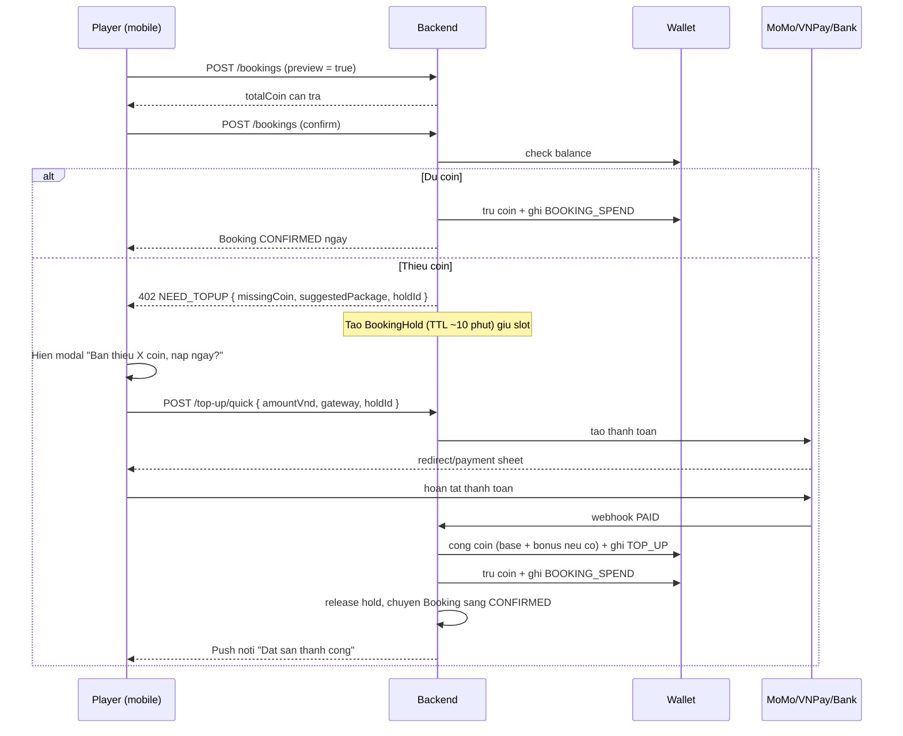
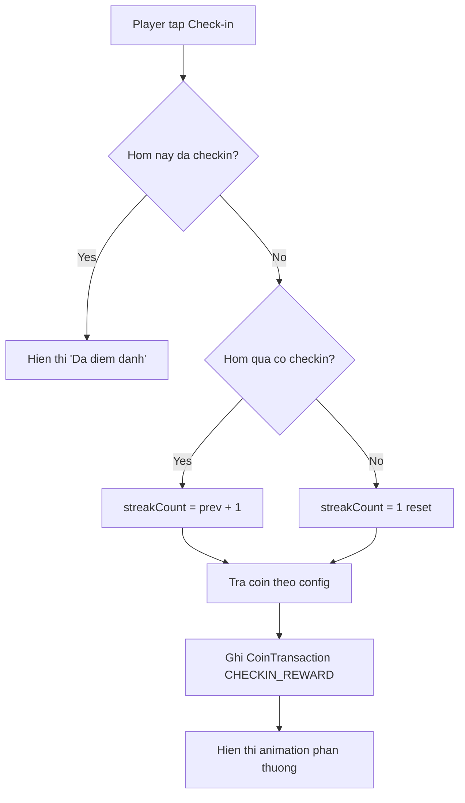
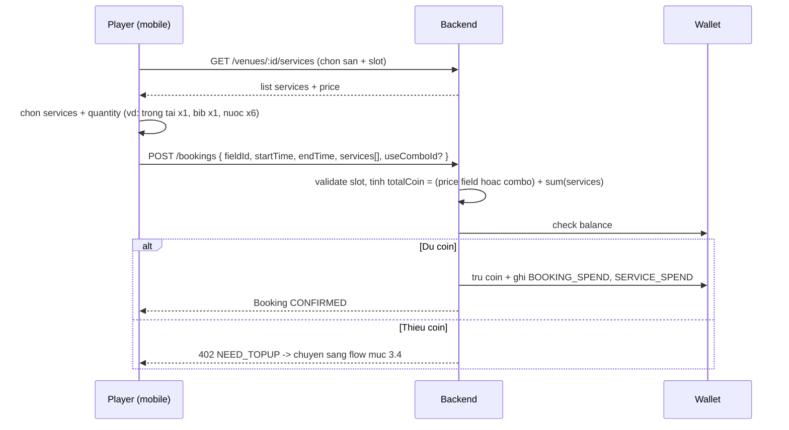
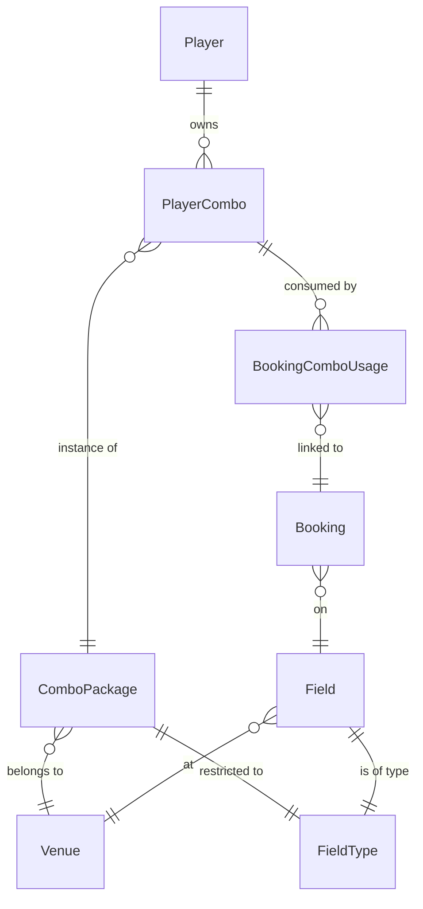
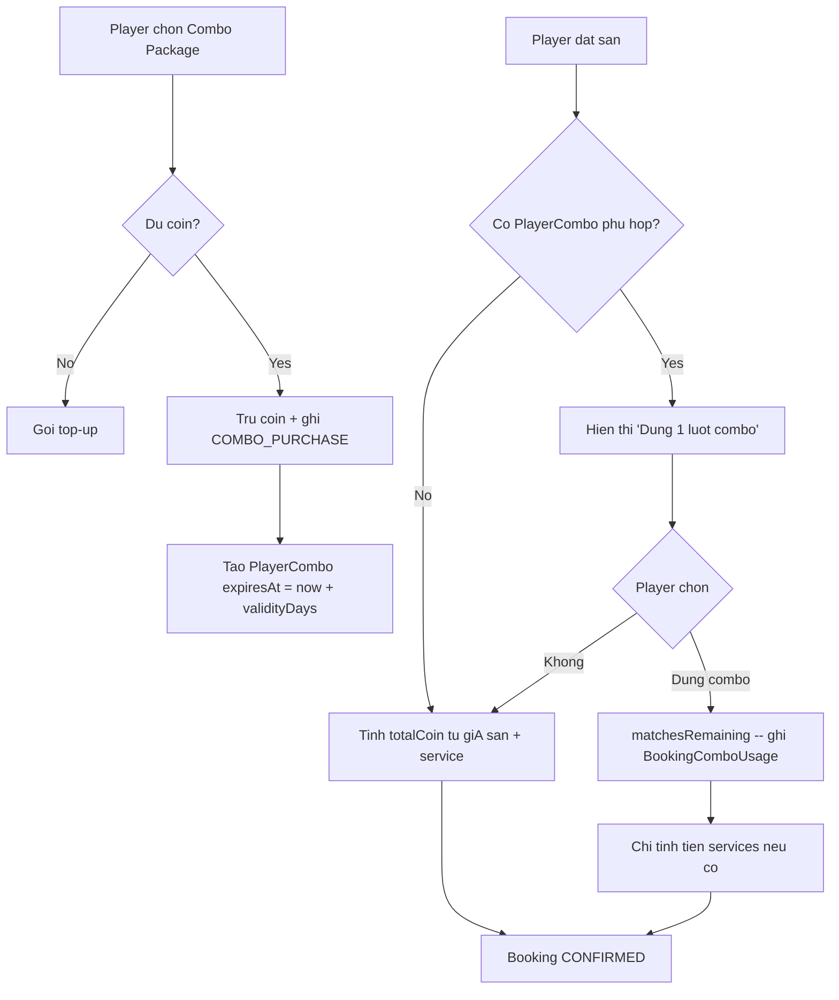
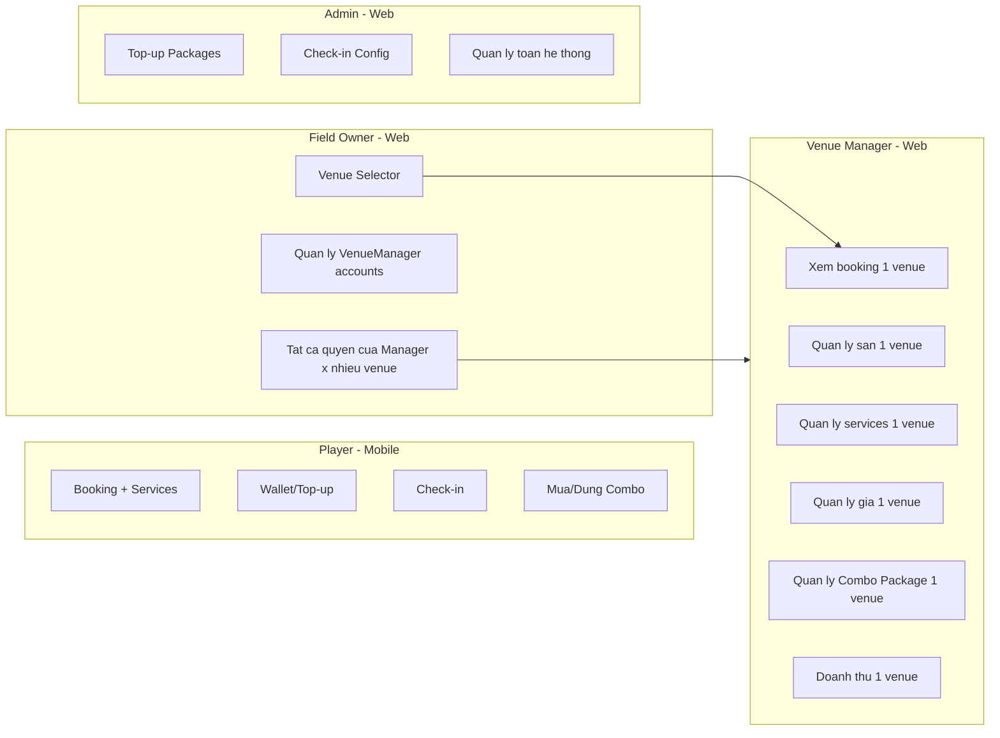

# Ballmate – Spec mở rộng: Venue Manager + Coin/Combo/Services cho Player

## 1. Phạm vi tổng quan

Bản mở rộng chia làm 2 nhánh độc lập về data nhưng dùng chung tầng auth/booking:

- **Owner-side (web app `web-app/`)** – mở rộng mô hình quản lý: 1 Owner ↔ nhiều Venue ↔ nhiều Manager.

- **Player-side (mobile app `mobile-app/ballmate/`)** – kinh tế trong app: coin wallet, top-up khuyến mãi, check-in streak, services kèm booking, combo membership theo venue + fieldType.

Stack giữ nguyên: NestJS + Prisma + PostgreSQL ([backend/ballmate-rest](backend/ballmate-rest)), React (web), React Native Expo (mobile).

---

## 2. Owner-side: Venue Manager + Owner Venue Selector

### 2.1 Mô hình role mới

- Thêm role `VENUE_MANAGER` vào enum `UserRole` ([backend/ballmate-rest/prisma/schema.prisma](backend/ballmate-rest/prisma/schema.prisma)).

- Thêm model `VenueManager { id, userId @unique, venueId, createdById (Owner), isActive, createdAt, updatedAt, deletedAt }`.

- Ràng buộc nghiệp vụ:
  - 1 `VenueManager` khóa chặt vào đúng **1 venue**. Không thể đổi venue (nếu cần đổi → deactivate rồi tạo mới).

  - 1 venue có thể có **nhiều VenueManager** (nhân viên ca, ca trưởng…), nhưng MVP chỉ cần hỗ trợ 1 là đủ.

  - Chỉ Owner của venue đó (hoặc Admin) mới được CRUD VenueManager.

### 2.2 Phân quyền (authorization scope)

Tất cả endpoint hiện có `/venues`, `/fields`, `/bookings`, `/revenue`, sắp tới là `/services`, `/combos`…) cần bổ sung **venue-scope guard**:

| Role | Quyền truy cập venue |

| --------------- | ----------------------------------------------- |

| `ADMIN` | tất cả |

| `FIELD_OWNER` | chỉ các venue có `ownerId = self.fieldOwner.id` |

| `VENUE_MANAGER` | chỉ venue có `id = self.venueManager.venueId` |

| `PLAYER` | chỉ read public |

Implement bằng 1 guard chung `VenueAccessGuard`) đọc venueId từ route param/body và check role.

### 2.3 Luồng cấp account Manager

Owner cũng có thể: reset mật khẩu, deactivate, hoặc xóa Manager.

### 2.4 Venue Selector cho Owner

- Owner đăng nhập web → dashboard hiển thị **danh sách venue mình sở hữu** (card view).

- Chọn 1 venue → mọi trang con (Quản lý sân, Lịch đặt, Doanh thu, Bảo trì, Báo cáo, …) đều scope theo `venueId` đó.

- Manager đăng nhập → bypass selector, vào thẳng dashboard venue của mình; ẩn hoàn toàn UI selector.

Thay đổi ở [web-app/src/components/Sidebar/Sidebar.tsx](web-app/src/components/Sidebar/Sidebar.tsx): thêm component `VenueSwitcher` ở header và 1 React context `CurrentVenueContext` xuyên suốt các trang.

---

## 3. Player-side: Coin Wallet

### 3.1 Mô hình dữ liệu

- `Wallet { id, playerId @unique, coinBalance Decimal, updatedAt }` – mỗi player có 1 ví.

- `CoinTransaction { id, walletId, type, amount (Decimal, có dấu), balanceAfter, referenceType, referenceId, description, createdAt }`.

- Enum `CoinTransactionType`: `TOP_UP`, `TOP_UP_BONUS`, `BOOKING_SPEND`, `SERVICE_SPEND`, `COMBO_PURCHASE`, `COMBO_REFUND`, `CHECKIN_REWARD`, `REFUND`, `ADMIN_ADJUST`.

- Conversion rate **1 coin = 1.000 VND** (config global, có thể đổi).

### 3.2 Top-up có khuyến mãi theo mệnh giá

- `TopUpPackage { id, name, priceVnd, baseCoin, bonusCoin, isActive, sortOrder }` – Admin quản lý.

- Ví dụ:
  - 100.000đ → 100 coin (no bonus)

  - 500.000đ → 500 + 50 coin (10% bonus)

  - 1.000.000đ → 1.000 + 150 coin (15% bonus)

  - 2.000.000đ → 2.000 + 400 coin (20% bonus)

- `TopUpOrder { id, playerId, packageId, priceVnd, expectedCoin, status (PENDING/PAID/FAILED/REFUNDED), gateway (MOMO/VNPAY/BANK), transactionId, paidAt, createdAt }`.

- Khi gateway callback PAID → cộng `baseCoin + bonusCoin` vào ví và ghi 2 `CoinTransaction` `TOP_UP` + `TOP_UP_BONUS`) để dễ thống kê.

### 3.3 Tác động lên booking & payment hiện tại

- Booking chuyển từ **trả bằng VND trực tiếp → trả bằng coin** (đơn vị nội bộ duy nhất). Tuy nhiên player **không bắt buộc top-up trước**: nếu thiếu coin, hệ thống bật flow "**Top-up just-in-time**" 1-click ngay trong màn confirm booking (xem mục 3.4).

- Trường `Booking.totalPrice` (đang Float = VND) bổ sung thêm `totalCoin Decimal`. Trong giai đoạn migration giữ song song; sau đó dùng `totalCoin` là chính.

- Model `Payment` hiện tại ([backend/ballmate-rest/prisma/schema.prisma:185](backend/ballmate-rest/prisma/schema.prisma)) được **giữ nguyên ý nghĩa nhưng chỉ dùng cho luồng top-up coin**, không còn link 1-1 với booking nữa. Booking spend được track bằng `CoinTransaction` (referenceType = `BOOKING`).

### 3.4 Top-up just-in-time trong flow booking

Mục tiêu: backend chỉ có **1 dòng tiền duy nhất là coin** (để kế toán, combo, service, refund đều đơn giản), nhưng UX cho player gần giống "trả bằng chuyển khoản trực tiếp" — không bắt nạp tiền lẻ vào ví trước.

Luồng:

Chi tiết:

- **BookingHold**: 1 bảng nhẹ `{ id, fieldId, startTime, endTime, playerId, totalCoin, expiresAt }` để **khóa slot** trong thời gian player đi qua gateway. Hết TTL không paid → tự release.

- **Quick top-up**: số coin nạp tối thiểu = `missingCoin`. Frontend gợi ý nâng lên gói gần nhất có bonus (để player tận dụng khuyến mãi), nhưng player có quyền chỉ nạp đủ.

- **Coin lẻ thừa**: nếu player nạp đúng gói có bonus → sau khi trừ booking, coin thừa giữ trong ví, dùng cho lần sau. Đây là incentive ngầm để dần dần player giữ tiền trong hệ thống.

- **Combo & check-in reward**: vẫn coin-only như bình thường. Combo chỉ mua bằng coin trong ví — nếu player muốn mua combo mà ví thiếu, flow tương tự (top-up just-in-time cho mục đích mua combo).

- **Báo lỗi gateway**: nếu top-up FAILED hoặc TIMEOUT → release hold, booking không tạo, ghi `TopUpOrder.status = FAILED` (không ảnh hưởng ví).

- **Atomicity**: bước "cộng coin từ top-up" và "trừ coin cho booking" nằm trong **1 DB transaction** sau khi gateway webhook PAID, đảm bảo không có trạng thái "đã nạp nhưng booking fail" để xử lý thủ công.

---

## 4. Player-side: Daily Check-in & Streak

### 4.1 Mô hình

- `CheckIn { id, playerId, date (DATE, unique cùng playerId), streakCount, coinRewarded, createdAt }`.

- `CheckInRewardConfig { id, streakDay (1..N), coinReward, isMilestone, label }` – Admin config. Ví dụ:
  - Ngày 1: 5 coin

  - Ngày 2: 5 coin

  - Ngày 3: 10 coin (milestone)

  - Ngày 7: 30 coin (milestone)

  - Ngày 14: 70 coin

  - Ngày 30: 200 coin

  - Sau 30 vòng lại từ 1 hoặc theo rule khác (config).

### 4.2 Logic streak

- 1 ngày = 1 lần check-in (theo timezone Asia/Ho_Chi_Minh).

- UI mobile: 1 dải 7 ngày tới hiển thị reward tăng dần, có "fire icon" cho streak hiện tại.

---

## 5. Player-side: Dịch vụ kèm booking (Services)

### 5.1 Mô hình

- `VenueService { id, venueId, name, description, category (REFEREE/EQUIPMENT/FOOD_DRINK/OTHER), priceCoin, unit (per_match/per_hour/per_item), images, isActive, createdAt, updatedAt }`.
  - Mỗi venue có catalog dịch vụ riêng do Venue Manager / Owner cấu hình.

  - Ví dụ: "Thuê trọng tài: 50 coin / trận", "Bộ áo bib 12 cái: 20 coin / trận", "Nước suối Aquafina: 1 coin / chai".

- `BookingService { id, bookingId, venueServiceId, quantity, priceCoinAtBooking, totalCoin }` – snapshot giá tại thời điểm đặt.

### 5.2 Luồng đặt sân với services

- Services có thể **add/remove** trong khi booking còn `PENDING`. Khi `CONFIRMED` thì khóa.

- Hủy booking trước X giờ → refund coin về ví (có config % phí hủy).

- Nếu booking dùng combo `useComboId`) thì phần field price = 0, nhưng services vẫn tính bằng coin → cùng đi qua kiểm tra ví / just-in-time top-up nếu thiếu.

---

## 6. Player-side: Giá theo khung giờ (peak / off-peak)

User nhắc tới ví dụ 6h-18h = 50 coin, 18h-20h = 80 coin (peak), 20h-22h = 70 coin. Đây là nền tảng để combo có giá trị.

### 6.1 Mô hình

- `FieldPriceRule { id, fieldId, dayOfWeek (0-6 | NULL = all), startMinute (0-1439), endMinute, priceCoinPerHour, priority, isActive }`.

- Khi tính `totalCoin` của 1 booking: chia booking thành các đoạn 15 phút, mỗi đoạn rơi vào rule nào → lấy giá rule đó (rule có priority cao thắng), sum lên.

- `Field.pricePerHour` (đang là VND) trở thành **fallback** khi không có rule khớp; thêm `Field.basePriceCoinPerHour` (mới).

### 6.2 Hiển thị

- Mobile khi chọn slot: hiển thị tooltip giá theo từng khung giờ + tổng kết.

- Web (Venue Manager): màn "Quản lý giá theo khung giờ" cho từng field.

---

## 7. Player-side: Membership Combo (gói)

Đây là phần phức tạp nhất. Theo chốt với anh: **combo gắn 1 venue + 1 fieldType**.

### 7.1 Mô hình

- `ComboPackage { id, venueId, fieldType (FIELD_5VS5|7VS7|11VS11), name, description, matchCount, priceCoin, validityDays, isActive, createdAt, updatedAt, deletedAt }`.
  - Ví dụ tại Venue "Sân Thủ Đức":
    - "Combo 10 trận Sân 5" – fieldType=FIELD_5VS5, matchCount=10, priceCoin=600, validityDays=60.

    - "Combo 10 trận Sân 7" – fieldType=FIELD_7VS7, matchCount=10, priceCoin=1.000, validityDays=60.

    - "Combo 5 trận Sân 11" – fieldType=FIELD_11VS11, matchCount=5, priceCoin=900, validityDays=45.

- `PlayerCombo { id, playerId, comboPackageId, purchasedAt, expiresAt, matchesTotal, matchesRemaining, status (ACTIVE/EXPIRED/EXHAUSTED/REFUNDED) }`.

- `BookingComboUsage { id @unique, bookingId @unique, playerComboId, matchesConsumed, consumedAt }`.

### 7.2 Quan hệ entity (tóm tắt nhánh combo)

### 7.3 Luồng mua & sử dụng combo

Rule quan trọng:

- **Eligible combo** cho 1 booking phải thỏa: `comboPackage.venueId == field.venueId` **VÀ** `comboPackage.fieldType == field.fieldType` **VÀ** `status == ACTIVE` **VÀ** `now < expiresAt` **VÀ** `matchesRemaining > 0`.

- **1 booking = 1 match** bất kể duration hay peak/off-peak (như anh chốt).

- Khi player có nhiều combo eligible → mặc định chọn combo `expiresAt` gần nhất (FIFO theo hạn).

- Hủy booking đã dùng combo → hoàn lại 1 match vào `PlayerCombo`, status có thể chuyển ACTIVE lại (nếu trước đó là EXHAUSTED).

- Combo hết hạn → cron job hằng ngày chuyển status sang `EXPIRED`. **Không refund coin** cho match chưa dùng (theo policy thông thường; có thể đổi sau).

### 7.4 Quản lý combo (web)

- Trang mới trong web Venue Manager: `ComboPackageManagementPage` – CRUD combo cho venue của mình.

- Báo cáo: bao nhiêu PlayerCombo đang ACTIVE, doanh thu combo theo tháng (đơn vị coin & VND quy đổi).

---

## 8. Tổng hợp thay đổi schema Prisma

Bảng tóm tắt model **mới** và **được thay đổi**:

- **Mới**: `VenueManager`, `Wallet`, `CoinTransaction`, `TopUpPackage`, `TopUpOrder`, `BookingHold`, `CheckIn`, `CheckInRewardConfig`, `VenueService`, `BookingService`, `FieldPriceRule`, `ComboPackage`, `PlayerCombo`, `BookingComboUsage`.

- **Sửa**: `User.role` enum (`VENUE_MANAGER`), `Field` (`basePriceCoinPerHour`), `Booking` (`totalCoin`, +relation `services`, +relation `comboUsage` optional), `Payment` (chuyển ngữ nghĩa sang top-up; có thể đổi `bookingId` thành nullable hoặc tách thành model riêng).

Quyết định mở: có nên tách `Payment` hiện tại thành `TopUpPayment` riêng hay không – đề xuất **tách** để semantic rõ ràng, tránh confuse.

---

## 9. Tác động lên 3 ứng dụng

### 9.1 Backend ([backend/ballmate-rest/src](backend/ballmate-rest/src))

Module **mới**:

- `venue-manager/` – CRUD manager cho owner.

- `wallet/` – đọc balance, list transactions.

- `top-up/` – packages CRUD (admin), create order theo package, **quick top-up just-in-time** (số coin tùy chọn để bù booking), webhook gateway, quản lý `BookingHold`.

- `check-in/` – endpoint check-in, config CRUD (admin).

- `venue-service/` – catalog services per venue.

- `field-price-rule/` – CRUD rule theo giờ.

- `combo/` – combo package CRUD + player combo (purchase, list, use).

Module **sửa**:

- `auth/` – thêm flow tạo manager, hỗ trợ role mới trong JWT payload và guards.

- `booking/` – nhận thêm `services[]` và `useComboId`, tính `totalCoin`, gọi wallet & combo tương ứng. Khi balance không đủ → trả `402 NEED_TOPUP` + tạo `BookingHold` thay vì lỗi. File chính sửa: [backend/ballmate-rest/src/booking/booking.service.ts](backend/ballmate-rest/src/booking/booking.service.ts).

- `venue/` – không đổi nhiều, nhưng tất cả query phía dashboard cần kèm venue-scope guard.

Cross-cutting: thêm `VenueAccessGuard` + decorator `@VenueScope('paramName')`.

### 9.2 Web app ([web-app/src](web-app/src))

- Component mới: `VenueSwitcher`, `CurrentVenueContext`.

- Trang mới: `VenueManagerListPage`, `VenueServiceManagementPage`, `FieldPriceRulePage`, `ComboPackageManagementPage`, `TopUpPackageManagementPage` (admin), `CheckInRewardConfigPage` (admin).

- Update [web-app/src/App.tsx](web-app/src/App.tsx) routing + [web-app/src/components/Sidebar/Sidebar.tsx](web-app/src/components/Sidebar/Sidebar.tsx) menu items.

### 9.3 Mobile app ([mobile-app/ballmate/src](mobile-app/ballmate/src))

Screen mới:

- `WalletScreen` – balance + history giao dịch coin.

- `TopUpScreen` – chọn package + chọn gateway.

- `CheckInScreen` (hoặc widget trong Home) – streak calendar 7-30 ngày.

- `ComboMarketScreen` – list combo theo venue đang xem.

- `MyCombosScreen` – combo đang sở hữu, còn bao nhiêu trận.

Update screen hiện có:

- [FieldDetailScreen.tsx](mobile-app/ballmate/src/screens/FieldDetailScreen.tsx) – hiển thị giá theo khung giờ + suggest combo.

- Booking flow – thêm bước chọn services + chọn dùng combo (nếu eligible). Khi confirm mà thiếu coin → mở `QuickTopUpSheet` (bottom sheet) hiển thị số coin còn thiếu, gợi ý gói top-up có bonus tốt nhất, sau khi gateway PAID tự động hoàn tất booking.

- [ProfileScreen.tsx](mobile-app/ballmate/src/screens/ProfileScreen.tsx) – entry vào Wallet / Combos / Check-in.

API service: cập nhật [mobile-app/ballmate/src/services/api.ts](mobile-app/ballmate/src/services/api.ts) thêm các nhóm endpoint mới.

---

## 10. Phân quyền tổng kết

---

## 11. Giả định & open questions

Các giả định trong spec này, anh có thể chốt sau khi rà soát:

- 1 coin = 1.000 VND (cố định, configurable). _Anh có muốn rate khác không?_

- Booking thanh toán bằng coin (đã chốt) + **top-up just-in-time** khi thiếu (đã chốt). _Một dòng tiền duy nhất là coin._

- `BookingHold` TTL = 10 phút (đủ cho người dùng đi qua MoMo/VNPay). _Có muốn tăng/giảm?_

- Quick top-up khi thiếu coin: số coin nạp tối thiểu = `missingCoin`, không bắt buộc nạp gói có bonus. _Có muốn ép phải nạp gói cố định (như 100k, 500k…)?_

- Hủy booking dùng combo: hoàn lại 1 lượt vào combo (không hoàn coin). _Có cần áp dụng phí hủy?_

- Combo hết hạn: không refund. _Hay refund 50% coin tỉ lệ matches còn lại?_

- 1 venue – nhiều VenueManager (MVP làm 1 cũng được). _Anh muốn enforce strict 1-1?_

- Service "Thuê trọng tài" hiện chỉ là item tính tiền, **không** ghép lịch thực với trọng tài cụ thể. Nếu cần roster trọng tài → tách feature riêng giai đoạn sau.

- Daily check-in reset streak: nếu nghỉ 1 ngày → reset về 1. _Có muốn "streak freeze" (dùng coin để giữ streak) không?_

---

## 12. Roadmap đề xuất (thứ tự triển khai)

Khi nào anh duyệt spec, có thể bóc thành 5 phase:

1. **Phase 1 – Venue Manager + Owner Selector** (foundation, ít rủi ro).

2. **Phase 2 – Coin Wallet + Top-up + chuyển booking sang coin** (đổi đơn vị tiền, migrate dữ liệu).

3. **Phase 3 – Daily Check-in & Streak** (driver kéo người dùng quay lại).

4. **Phase 4 – Services + Field Price Rule** (làm dày booking).

5. **Phase 5 – Combo Membership** (sau khi coin & price rule đã chạy mượt, vì combo phụ thuộc cả 2).
