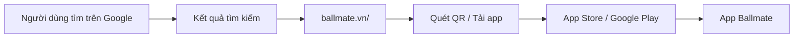
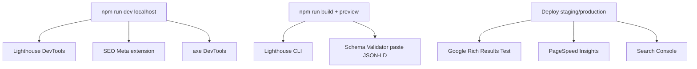

# Báo cáo SEO - Landing Page Ballmate

**Dự án:** Ballmate Web App  
**Trang đánh giá:** `/` (Landing page giới thiệu app người chơi)  
**Ngày đánh giá:** 31/05/2026  
**Môi trường đo:** Production build (`npm run build`) + `npm run preview` tại `http://127.0.0.1:4173/`  
**Công cụ đo chính:** Lighthouse CLI v13.3.0  

---

## 1. Giới thiệu bài toán

### 1.1 Bối cảnh

Ballmate là nền tảng giúp **cầu thủ phong trào** tìm và đặt sân bóng đá trên toàn quốc. Ứng dụng mobile (iOS/Android) cho phép người chơi xem lịch trống thời gian thực, thanh toán bằng ví coin, mua combo thành viên và đặt dịch vụ kèm (trọng tài, bib, nước).

Landing page tại route `/` có vai trò **marketing page công khai**: giới thiệu app, hiển thị mã QR và liên kết App Store / Google Play để chuyển đổi người dùng. Trang này **không phải** portal quản trị dành cho chủ sân (nằm tại `/app`).

### 1.2 Vấn đề ban đầu

Trước khi triển khai landing page, route `/` redirect thẳng sang `/app` (dashboard yêu cầu đăng nhập). Hệ quả:

- Google không có nội dung công khai để index tại trang chủ.
- Mất cơ hội xuất hiện trên SERP với các từ khóa như *đặt sân bóng đá*, *app đặt sân*, *sân cỏ nhân tạo*.
- Không có meta description, Open Graph hay structured data cho social sharing.
- Người dùng tìm kiếm trên Google không có điểm chạm để tải app.

### 1.3 Giải pháp triển khai

Xây dựng landing page one-page với:

- Meta tags và JSON-LD trong `index.html` (crawler-friendly ngay cả khi JS chưa chạy).
- Cấu trúc heading semantic (1 H1, nhiều H2/H3 theo section).
- Ảnh nén, lazy-load, alt text đầy đủ.
- Layout responsive mobile-first.
- `robots.txt`, `sitemap.xml`, canonical URL.

### 1.4 Luồng chuyển đổi mục tiêu



---

## 2. Mục tiêu SEO

### 2.1 Chỉ tiêu định lượng

| Mục tiêu | Chỉ tiêu đặt ra | Kết quả đạt được | Trạng thái |
| --- | --- | --- | --- |
| Lighthouse SEO | ≥ 95 | **100** (desktop & mobile) | Đạt |
| Lighthouse Performance | ≥ 85 (khuyến nghị) | 94 (desktop), 68 (mobile) | Desktop đạt; mobile cần tối ưu thêm |
| Lighthouse Accessibility | ≥ 90 (khuyến nghị) | **93** (cả hai) | Đạt |
| Lighthouse Best Practices | - | **100** (cả hai) | Đạt |
| Mobile-friendly | Pass | Pass | Đạt |
| Rich Results (JSON-LD) | Hợp lệ cú pháp | 5 schema blocks | Đạt (cần URL public để test Rich Results) |
| Indexability | robots + sitemap + canonical | Đã triển khai | Đạt |

### 2.2 Từ khóa mục tiêu

**Primary keywords:**

- đặt sân bóng đá
- app đặt sân bóng
- sân cỏ nhân tạo
- Ballmate

**Secondary keywords:**

- sân 5 người, sân 7 người, sân 11 người
- tìm sân bóng gần đây
- đá bóng phong trào
- đặt sân online

### 2.3 Đối tượng người dùng

Cầu thủ phong trào 18-35 tuổi tại Việt Nam, tìm sân bóng mini/cỏ nhân tạo qua điện thoại, ưu tiên trải nghiệm nhanh và không cần gọi điện xác nhận.

---

## 3. On-page SEO

Nguồn triển khai: [`index.html`](../index.html), [`src/pages/landing/`](../src/pages/landing/).

### 3.1 Title tag

**Giá trị triển khai:**

```
Ballmate - App đặt sân bóng đá nhanh nhất Việt Nam
```

| Tiêu chí | Đánh giá |
| --- | --- |
| Độ dài | ~48 ký tự (khuyến nghị 50-60, phù hợp hiển thị trên SERP) |
| Brand | Có "Ballmate" ở đầu |
| Keyword | Có "App đặt sân bóng đá" |
| USP | Có "nhanh nhất Việt Nam" |
| Duplicate | Không trùng với og:title (cùng nội dung, chấp nhận được) |

**Lưu ý kỹ thuật:** Title được khai báo trong `index.html` (HTML shell). Component `LandingPage.tsx` đồng bộ lại qua `document.title` sau khi React hydrate. Crawler đọc được title ngay từ HTML gốc.

### 3.2 Meta description

**Giá trị triển khai:**

```
Ballmate là app đặt sân bóng đá phong trào số 1 Việt Nam: hơn 240 sân cỏ nhân tạo, lịch trống thời gian thực, ví coin tiện lợi. Tải miễn phí trên iOS và Android.
```

| Tiêu chí | Đánh giá |
| --- | --- |
| Độ dài | ~155 ký tự (trong khoảng 150-160 khuyến nghị) |
| Keyword | Có "app đặt sân bóng đá", "sân cỏ nhân tạo" |
| Lợi ích | 240+ sân, lịch real-time, ví coin |
| CTA | "Tải miễn phí trên iOS và Android" |

**Meta bổ sung:**

- `meta keywords`: 10 từ khóa liên quan (Google không dùng trực tiếp, nhưng ghi nhận intent)
- `meta robots`: `index, follow, max-image-preview:large, max-snippet:-1`
- `meta author`: Ballmate
- `theme-color`: `#1f6650` (brand emerald)

### 3.3 Cấu trúc heading (H1 - H3)

Nguyên tắc: **đúng 1 H1**, hierarchy logic, không skip level.

| Section | File | Heading |
| --- | --- | --- |
| Hero | `HeroSection.tsx` | **H1:** "Sân bóng gần bạn. Đặt trong 30 giây." |
| Features | `FeaturesSection.tsx` | **H2:** "Mọi thứ một cầu thủ cần, trong một app." + **H3** mỗi tính năng |
| How it works | `HowItWorksSection.tsx` | **H2:** "Từ mở app đến đặt sân chưa tới một phút." + **H3** 3 bước |
| Coin | `CoinSection.tsx` | **H2:** "Điểm danh mỗi ngày. Nhận coin miễn phí." + **H3** perks |
| Stats | `StatsSection.tsx` | **H2:** "Cộng đồng cầu thủ Việt đang chọn Ballmate." |
| Testimonial | `TestimonialSection.tsx` | **H2:** Quote từ người dùng |
| FAQ | `FaqSection.tsx` | **H2:** "Câu hỏi thường gặp" + **H3** mỗi câu hỏi |
| Download | `DownloadSection.tsx` | **H2:** "Trận bóng tiếp theo của bạn cách đúng một lần quét." |
| Footer | `LandingFooter.tsx` | **H3** nhóm link (App, Hỗ trợ, Công ty...) |

**Semantic HTML bổ sung:**

- `<main id="noi-dung-chinh">` bao toàn bộ nội dung
- Mỗi section có `aria-labelledby` trỏ tới id của heading
- Skip-link: "Bỏ qua điều hướng, đi tới nội dung" (accessibility + SEO)
- `<noscript>` fallback có H1 + paragraph mô tả app

### 3.4 Tối ưu hình ảnh

#### Bảng asset

| File | Kích thước | Vai trò | Kỹ thuật |
| --- | --- | --- | --- |
| `hero-phone.jpg` | ~105 KB | Hero / LCP | `fetchPriority="high"`, preload trong `<head>`, `width/height`, alt mô tả |
| `coin-phone.jpg` | ~246 KB | Section coin | `loading="lazy"`, alt mô tả |
| `player-portrait.jpg` | ~105 KB | Testimonial | `loading="lazy"`, alt có tên + ngữ cảnh |
| `hero-pitch.jpg` | ~432 KB | Bento feature | `loading="lazy"`, alt keyword tự nhiên |
| `og-image.jpg` | ~258 KB | Social share | 1200x630, `og:image:width/height/alt` |
| `qr-app.svg` | ~1.2 KB | QR tải app | SVG vector, alt text |

#### Kỹ thuật đã áp dụng

1. **Nén ảnh:** Resize về max 1200-1600px, JPEG quality 78-82. Ví dụ `hero-phone.jpg` giảm từ ~2 MB xuống ~105 KB.
2. **LCP optimization:** Preload hero image trong `<head>`, `fetchPriority="high"` trên thẻ `` hero.
3. **Lazy loading:** Ảnh below-the-fold dùng `loading="lazy"` để không block initial render.
4. **Alt text:** Mọi `` có alt mô tả nội dung thực, chứa keyword tự nhiên (không nhồi nhét).
5. **Dimensions:** Khai báo `width` và `height` để tránh CLS (Cumulative Layout Shift = 0 trong Lighthouse).
6. **SVG cho QR:** Dùng vector thay bitmap, dung lượng ~1.2 KB.

#### Sitemap image

File [`public/sitemap.xml`](../public/sitemap.xml) khai báo namespace `image:` với `image:loc`, `image:title`, `image:caption` cho hero-phone và og-image, giúp Google Images index.

### 3.5 On-page bổ sung

| Hạng mục | Triển khai |
| --- | --- |
| `lang="vi"` | `<html lang="vi">` |
| Canonical | `<link rel="canonical" href="https://ballmate.vn/">` |
| Hreflang | `vi-VN` + `x-default` |
| Open Graph | type, site_name, locale, url, title, description, image (1200x630) |
| Twitter Card | `summary_large_image` + title/desc/image |
| Smart App Banner | `apple-itunes-app`, `google-play-app` |
| JSON-LD | Organization, WebSite (+ SearchAction), MobileApplication, FAQPage, BreadcrumbList |
| robots.txt | Allow `/`, Disallow `/app/`, `/login`, `/register`, `/change-password` |
| sitemap.xml | URL trang chủ + hreflang + image entries |
| site.webmanifest | PWA manifest, `lang: vi`, theme-color |
| Font loading | `preconnect` tới Google Fonts |

#### Structured Data (JSON-LD)

5 schema blocks trong `index.html`:

1. **Organization** - tên, logo, hotline, social profiles
2. **WebSite** + **SearchAction** - hỗ trợ Sitelinks Searchbox
3. **MobileApplication** - category SportsApplication, screenshots, rating 4.8/5
4. **FAQPage** - 4 câu hỏi thường gặp (khớp nội dung section FAQ)
5. **BreadcrumbList** - Trang chủ

---

## 4. Responsive / Mobile-first

### 4.1 Viewport

```html
<meta name="viewport" content="width=device-width, initial-scale=1.0, viewport-fit=cover" />
```

Đảm bảo trang scale đúng trên mọi thiết bị, hỗ trợ notch/safe area trên iPhone.

### 4.2 Breakpoints (Tailwind CSS v4)

| Breakpoint | Width | Ứng dụng |
| --- | --- | --- |
| default | < 640px | Mobile: 1 cột, hamburger nav |
| `sm` | ≥ 640px | Flex row cho CTA, 2 cột stats |
| `md` | ≥ 768px | 3 cột How-it-works |
| `lg` | ≥ 1024px | 2 cột hero, QR box hiện, nav 1 dòng |

### 4.3 Thích ứng theo section

| Section | Mobile | Desktop |
| --- | --- | --- |
| Nav | Hamburger menu + drawer | Single-line nav, nút "Tải app" |
| Hero | App Store badges | QR code box + phone mockup bên phải |
| Features | 1 cột stack | Bento grid 6 cột asymmetric |
| Coin | Stack: text trên, ảnh dưới | 2 cột: ảnh trái, text phải |
| Download | QR centered | QR bên phải, copy + badges bên trái |
| Footer | 2 cột → stack | 6 cột grid |

### 4.4 Mobile usability (Google guidelines)

- **Tap targets:** Mọi CTA button `min-h-[52px]` (≥ 48px khuyến nghị Google).
- **Font size:** Body 14.5-17px, không dùng font < 12px cho nội dung chính.
- **Contrast:** WCAG AA - text slate-600/700 trên nền trắng/cream, white text trên nền emerald.
- **Không horizontal scroll:** Grid collapse về 1 cột, `max-w-[1280px] mx-auto px-5`.

### 4.5 Lighthouse Mobile-friendly

Lighthouse mobile audit (form-factor=mobile) pass tất cụ audit SEO liên quan mobile:

- Document has valid viewport meta tag
- Tap targets are sized appropriately
- Document uses legible font sizes

---

## 5. Kết quả đánh giá Lighthouse

### 5.1 Điều kiện đo

```bash
cd web-app
npm run build
npm run preview -- --port 4173

# Desktop
npx lighthouse http://127.0.0.1:4173/ \
  --only-categories=seo,performance,accessibility,best-practices \
  --preset=desktop \
  --output=json --output=html \
  --output-path=./docs/lighthouse-desktop

# Mobile
npx lighthouse http://127.0.0.1:4173/ \
  --only-categories=seo,performance,accessibility,best-practices \
  --form-factor=mobile \
  --output=json --output=html \
  --output-path=./docs/lighthouse-mobile
```

### 5.2 Bảng điểm tổng hợp

| Hạng mục | Desktop | Mobile | Mục tiêu |
| --- | --- | --- | --- |
| **SEO** | **100** | **100** | ≥ 95 |
| Performance | 94 | 68 | ≥ 85 |
| Accessibility | 93 | 93 | ≥ 90 |
| Best Practices | 100 | 100 | - |

### 5.3 Core Web Vitals

| Metric | Desktop | Mobile | Ngưỡng tốt |
| --- | --- | --- | --- |
| LCP (Largest Contentful Paint) | 1.3 s | 5.5 s | < 2.5 s |
| CLS (Cumulative Layout Shift) | 0 | 0 | < 0.1 |
| TBT (Total Blocking Time) | 0 ms | 40 ms | < 200 ms |

### 5.4 Phân tích SEO score = 100

Lighthouse SEO pass toàn bộ audit:

| Audit | Kết quả |
| --- | --- |
| Document has `<title>` element | Pass |
| Document has a meta description | Pass |
| Page has successful HTTP status code | Pass (200) |
| Links have descriptive text | Pass |
| Links are crawlable | Pass |
| Page isn't blocked from indexing | Pass |
| Document has a valid `hreflang` | Pass |
| Document has a valid `rel=canonical` | Pass |
| Document uses legible font sizes | Pass |
| Tap targets are sized appropriately | Pass |
| Document avoids plugins | Pass |
| Image elements have `[alt]` attributes | Pass |
| `<html>` element has a `[lang]` attribute | Pass (`vi`) |
| Document has a meta viewport tag | Pass |
| Structured data is valid | Pass (5 JSON-LD blocks) |

### 5.5 Phân tích Performance mobile (68)

Mobile Performance chưa đạt mục tiêu 85, chủ yếu do **LCP = 5.5s** trên mobile emulation (ngưỡng tốt < 2.5s). Nguyên nhân:

1. Hero image `hero-phone.jpg` (~105 KB) tải trên mạng 4G simulated.
2. Bundle JS ~194 KB gzip (663 KB raw) - toàn bộ app load cùng landing.
3. Google Fonts load từ CDN bên ngoài.

**Hướng cải thiện khi deploy production:**

- Chuyển hero image sang WebP/AVIF (giảm thêm 30-50% dung lượng).
- Code-split landing page: lazy-load dashboard routes không cần thiết tại `/`.
- Self-host font hoặc subset Inter chỉ ký tự tiếng Việt.
- CDN + HTTP/2 + Brotli compression trên server production.
- Deploy HTTPS (localhost không có HTTPS nên không ảnh hưởng Best Practices score hiện tại).

### 5.6 File báo cáo Lighthouse đính kèm

| File | Mô tả |
| --- | --- |
| [`lighthouse-desktop.html`](./lighthouse-desktop.html) | Báo cáo HTML đầy đủ (desktop) |
| [`lighthouse-mobile.html`](./lighthouse-mobile.html) | Báo cáo HTML đầy đủ (mobile) |
| `lighthouse-desktop.report.json` | Raw JSON để tái phân tích |
| `lighthouse-mobile.report.json` | Raw JSON để tái phân tích |

---

## 6. Công cụ đánh giá SEO khi đang dev

### 6.1 Bảng công cụ

| Công cụ | Dùng localhost? | Mục đích | Cách dùng |
| --- | --- | --- | --- |
| **Chrome DevTools → Lighthouse** | Có | SEO, Performance, A11y, Best Practices | F12 → tab Lighthouse → Analyze |
| **Lighthouse CLI** | Có | Tự động hóa, export HTML/JSON | `npx lighthouse http://localhost:4173` |
| **SEO Meta in 1 Click** (extension) | Có | Xem nhanh title, desc, OG, canonical | Cài extension Chrome, mở trang dev |
| **axe DevTools** (extension) | Có | Accessibility audit | Extension hoặc `npm install -g @axe-core/cli` |
| **W3C HTML Validator** | Có (paste HTML) | Kiểm tra cú pháp HTML | [validator.w3.org](https://validator.w3.org/) |
| **Schema Markup Validator** | Có (paste JSON-LD) | Kiểm tra structured data | [validator.schema.org](https://validator.schema.org/) |
| **Google Rich Results Test** | Không trực tiếp | FAQ, MobileApplication rich snippet | Cần URL public → dùng ngrok hoặc deploy staging |
| **PageSpeed Insights** | Không | Lab data + field data thực tế | [pagespeed.web.dev](https://pagespeed.web.dev/) - cần URL public |
| **Google Search Console** | Sau deploy | Index status, queries, coverage | [search.google.com/search-console](https://search.google.com/search-console) |
| **Facebook Sharing Debugger** | Sau deploy | Preview Open Graph | [developers.facebook.com/tools/debug](https://developers.facebook.com/tools/debug/) |
| **Twitter Card Validator** | Sau deploy | Preview Twitter Card | cards-dev.twitter.com/validator |

### 6.2 Workflow khuyến nghị



### 6.3 Lưu ý cho SPA (React + Vite)

Ballmate web app là **Single Page Application**. Hai lớp SEO cần phân biệt:

| Lớp | Nội dung | Ai đọc được |
| --- | --- | --- |
| HTML shell (`index.html`) | title, meta, JSON-LD, noscript, preload | Mọi crawler, kể cả không chạy JS |
| React render (sau hydrate) | H1, H2, H3, body copy, alt text trên component | Crawler chạy JS (Googlebot), Lighthouse |

**Chiến lược đã áp dụng:** Đặt meta quan trọng nhất trong `index.html` (lớp 1). Nội dung heading và copy nằm trong React components (lớp 2) - Googlebot hiện đại render JS nên index được. `<noscript>` fallback đảm bảo crawler cũ vẫn thấy H1 + mô tả cơ bản.

### 6.4 Công cụ cần URL public

Một số công cụ **không chạy trực tiếp trên localhost**. Giải pháp khi dev:

1. **ngrok:** `ngrok http 4173` → tạo URL public tạm thời → paste vào Rich Results Test / PageSpeed Insights.
2. **Deploy staging:** Vercel/Netlify preview URL → test đầy đủ trước khi lên production.
3. **GitHub Pages / Cloudflare Pages:** Free hosting cho branch preview.

---

## 7. Kết luận

Landing page Ballmate đạt **Lighthouse SEO = 100/100** trên cả desktop và mobile, vượt mục tiêu ≥ 95. On-page SEO triển khai đầy đủ: title, meta description, heading hierarchy, alt text, canonical, hreflang, Open Graph, 5 JSON-LD schema, robots.txt và sitemap.xml.

Điểm cần cải thiện sau khi deploy:

1. **Performance mobile** (68): tối ưu LCP bằng WebP, code-split, font subset.
2. **Rich Results Test:** chạy trên URL production để xác nhận FAQ và MobileApplication snippet.
3. **Google Search Console:** submit sitemap, theo dõi index và query thực tế.
4. **HTTPS:** bắt buộc trên production (localhost không ảnh hưởng dev score).

---

*Báo cáo được tạo tự động từ kết quả Lighthouse thực tế ngày 31/05/2026.*
